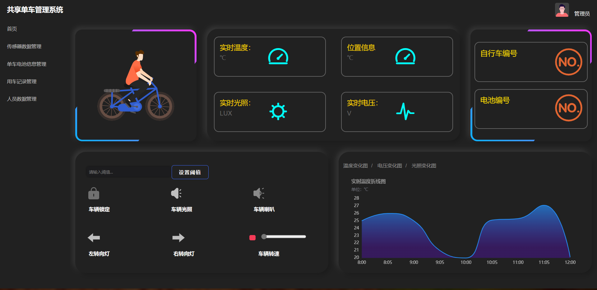

# 共享单车 

#### 介绍
基于物联网的共享单车

#### 软件架构
springboot+mybatisplus+layui，jdk是1.8版本的  mysql版本是8.0.28

#### 使用说明

分享一下自己的一些项目代码，可能写的不是很好，但是希望能帮助到大家。
该系统主要用于用户管理和城市共享单车的管理，对单车进行实时数据检测和巡检，并且实现对单车的远程控制。
如果有一些写的不是很好的地方还望指正。

#### 图片

 